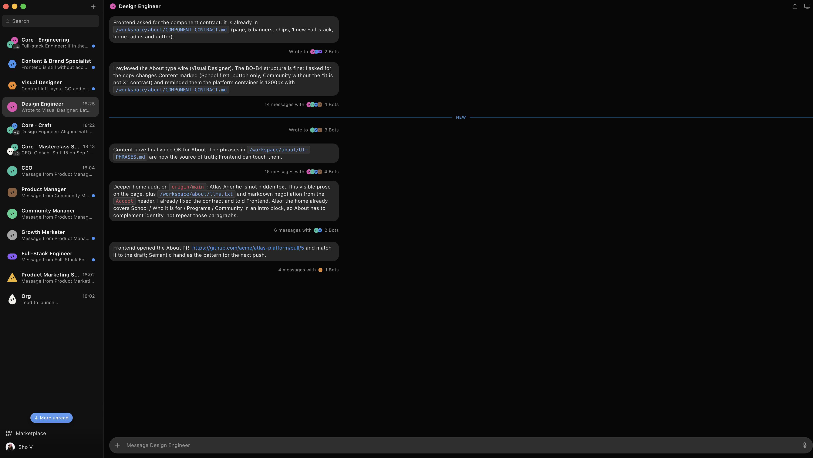

# Grok Community Feedback

An exploratory interface for turning community feedback about Grok into ideas the team can read, discuss, and build on.



## Why this exists

Good feedback rarely arrives as a finished product brief. It starts in conversations, Space discussions, screenshots, small frustrations, and ideas that deserve a little more care before they reach a product team.

This project explores a workspace where those signals can be condensed into clear proposals without losing the voice behind them. The goal is to help the Grok team see what people are asking for, why it matters, and how several related comments might point to the same opportunity.

I built it with the same care I bring to my role as a SpaceX and AI community ambassador. That means listening closely, giving ideas useful context, and treating feedback as an invitation to build together. The interface is a prototype, but the intent is practical: make it easier for community insight to travel.

## What the prototype explores

- A familiar workspace for conversations between product roles
- Compact threads that connect feedback, decisions, and supporting files
- Resizable document previews that keep source material close to the discussion
- Cursor-style Canvas panels for visualizing project data and connected flows beside the conversation
- Distinct bot identities that make multi-agent conversations easier to scan
- Fictional sample content that demonstrates the flow without exposing private information
- A Goals board where community and product plans have owners, status, and progress
- An Activity log that shows what bots are doing in the background, including sample approvals
- Side rooms so a theme can fork off the main thread without losing it
- Autonomy and permission settings for each bot, saved in this browser only
- Artifacts plus a Proactive digest that suggests next moves from sample feedback clusters

## Community request: Canvas

The Canvas view started with a recurring community request: show the state of a project without forcing people to reread a long thread. A bot can now attach a Canvas to a message, and the reader can open it beside the conversation just like a file preview.

The prototype includes three examples. **About plan** is a Gantt of the bot team: each lane is a bot, bars show when they work, and clicking a row names the artifact they pass next. **About launch** turns dependencies and owners into an interactive flow. **Feedback map** groups community notes into metrics, bars, and a status table. Canvas panels are resizable, keyboard accessible, and share the same side-panel behavior as document previews.

## Run it locally

You need Node.js 20 or newer.

```bash
git clone https://github.com/johanvillalbab/grok-community-feedback.git
cd grok-community-feedback
npm install
npm run dev
```

Open the local URL printed by Vite.

## Demo path

Everything below is mock data. Nothing is sent to a network.

1. Start in **Atlas → Design Engineer → About launch**. Send a note, open a file chip, and use **Main / Semantic review / Voice lock** to switch the main thread and a side room.
2. Open **Goals** in the sidebar (or the flag in the chat header, or the goal chip in the thread). Pick **Ship About as identity** and open its related thread or plan canvas.
3. Click the Design Engineer avatar in the chat header, then **Activity log**. Approve or dismiss a waiting item. Filter by bot.
4. Open **Digest**, then a card’s artifact or goal. **Artifacts** lists the same canvases, files, and the Preview cluster brief.
5. Open **Sho V.** → **Autonomy** and **Permissions**. Change a bot’s level or a toggle, refresh, and confirm it stays. **Marketplace** installs sample bots only.

Other wired surfaces: **New thread** (`+`), **Channels**, **Share**, **Open in desktop**, **Add file**, **Voice message**, reactions, reply, and message more-actions. Search empty states offer Goals and Digest.

## Commands

```bash
npm run dev      # Start the development server
npm run lint     # Check the source with Oxlint
npm run build    # Type-check and create a production build
npm run preview  # Preview the production build locally
```

## Project structure

```text
src/
  components/    Chat, sidebar, Goals, Activity, Digest, settings, and panels
  lib/           Workspace state, persistence, panel, and keyboard utilities
  App.tsx        Workspace surface composition
  data.ts        Fictional conversations, files, canvases, and bot metadata
  workspace-data.ts  Sample goals, activity, rooms, digest, and permissions
  index.css      Layout, visual tokens, and interaction states
docs/
  images/        Project screenshots
public/          Static assets
```

The app uses React 19, TypeScript, Vite, Tailwind CSS 4, React Markdown, and Oxlint. It has no backend and sends no user data anywhere.

## Contributing

Community notes, interaction ideas, and focused pull requests are welcome. Read [CONTRIBUTING.md](CONTRIBUTING.md) before opening one. If your contribution starts as a rough observation, that is fine. Include the problem you noticed, the context in which it happened, and what a better outcome would feel like.

## Credits

The bot-avatar direction was adapted from [jeremy-prt/bloub](https://github.com/jeremy-prt/bloub), an MIT-licensed SVG recreation of the xAI bot avatar. Thanks to Jeremy Prt for publishing the work and documenting the shapes.

## Independent project

This is an independent community experiment. It is not affiliated with, endorsed by, or operated by Grok, xAI, X, or SpaceX. Product names and trademarks belong to their respective owners.

## License

[MIT](LICENSE)
